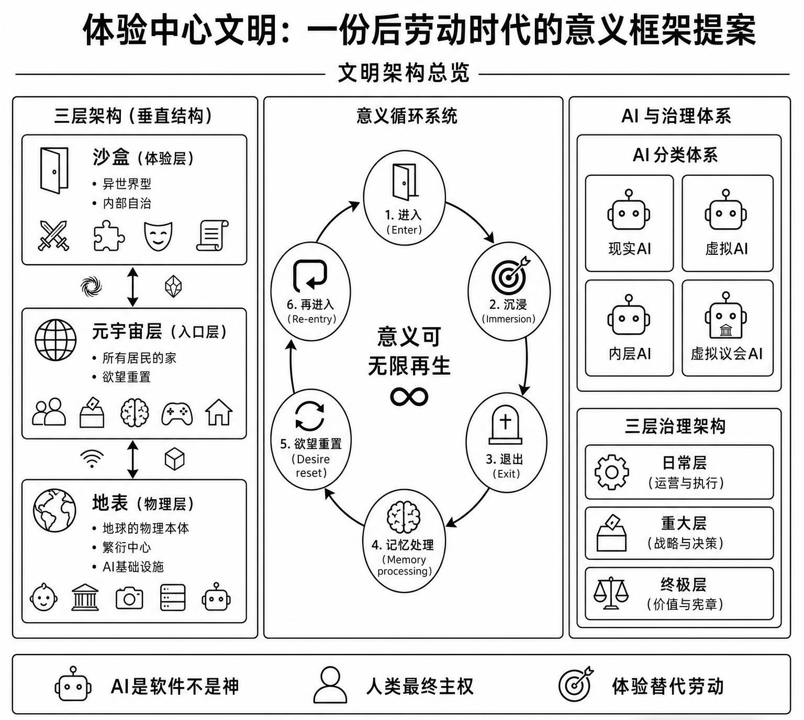

# 体验中心文明：一份后劳动时代的意义框架提案

## The Experience-Centered Civilization: A Meaning Framework for the Post-Labor Era

---

**[中文](#中文) | [English](#english)**

---

## 中文

AGI 替代了所有人类劳动。**人不再需要工作，为什么而活？**

这个思想实验的回答是：**体验替代劳动，成为意义的核心来源。**

它设计了一套完整的文明框架：

- **三层架构**——地表（物理繁衍与文明备份）、元宇宙层（公共空间与投票）、沙盒（无限虚拟体验）
- **意义循环**——进入沙盒 → 沉浸体验 → 退出 → 记忆处理与欲望重置 → 再进入，确保意义持续再生
- **AI 分类体系**——现实 AI、虚拟 AI、内层 AI（硅基人类）、虚拟议会 AI，严格分离，AI 仅为工具
- **三层治理**——日常层（AI 自动化）、重大层（全体人类直接民主）、终极层（文明存续底线契约）
- **记忆锚点**——现实记忆不可修改，虚拟记忆完全自主，防止无限自由消解自我

> 它不宣称真理，不要求权力。一个邀请，不是一个命令。

| 文件 | 说明 |
|:---|:---|
| `*.md` 中文版 | 提案全文 |
| `The Experience-Centered...md` | English version |
| `LICENSE` | CC BY-SA 4.0 |

[CC BY-SA 4.0](https://creativecommons.org/licenses/by-sa/4.0/) 开源。欢迎 Issue、PR、翻译、批评。

---

## English

AGI has replaced all human labor. **What does one live for when work is no longer necessary?**

This thought experiment answers: **experience replaces labor as the source of meaning.**

The framework:

- **Three layers** — Surface (reproduction & backup), Metaverse (public space & voting), Sandboxes (infinite virtual experiences)
- **Meaning cycle** — enter sandbox → immerse → exit → memory processing & desire reset → re-enter
- **AI classification** — Reality AI, Virtual AI, Inner-Layer AI (silicon humans), Virtual Parliament AI. Strictly separated. AI as tool, nothing more.
- **Three-tier governance** — Daily (AI automation), Major (direct democracy), Ultimate (Civilization Survival Baseline Compact)
- **Memory anchor** — real memories immutable, virtual memories fully autonomous

> It claims no truth, demands no power. An invitation, not a command.

| File | Description |
|:---|:---|
| `体验中心文明...md` | Full text (Chinese) |
| `The Experience-Centered...md` | Full text (English) |
| `LICENSE` | CC BY-SA 4.0 |

Open source under [CC BY-SA 4.0](https://creativecommons.org/licenses/by-sa/4.0/). Issues, PRs, translations, and critiques welcome.
