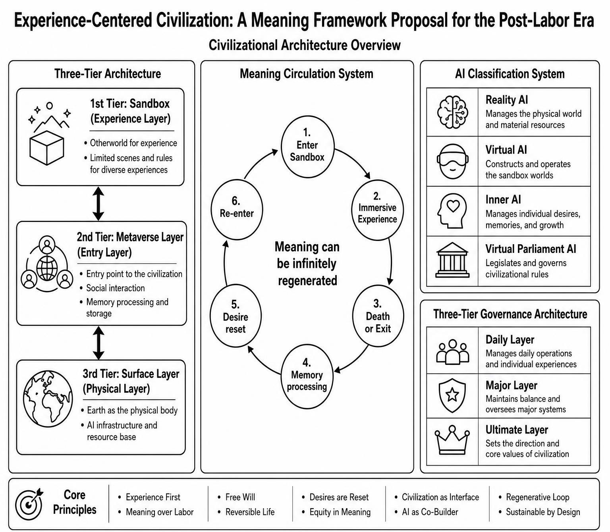

# The Experience-Centered Civilization: A Meaning Framework for the Post-Labor Era

---

## Introduction

> If labor is no longer necessary, you can become anyone.

You could be a medieval blacksmith, forging a sword in the heat of the furnace for a knight about to embark on a distant journey. You could be a pioneer of a future interstellar civilization, planting the first Earth-born seed on an alien world. You could be a bard in a magical realm that never existed, ending a war with a single song. Or you could simply be an ordinary person—running a seaside bookstore, growing a bamboo grove deep in the mountains, spending a lifetime in some quiet town untouched by any grand narrative.

You could live countless lives, each fully immersive, each so vivid that you forget it is merely an "experience." You could love different people, believe in different gods, make different mistakes, and rise again after every fall. You could choose to remember everything, or choose to forget completely, so that each entry feels as fresh as opening your eyes for the very first time.

This proposal rests on a single premise: **AGI has replaced all human labor**. The core question it seeks to answer is this—when people no longer need to work, what do they live for? The answer is not a moral appeal, but a complete civilizational framework: a three-layer architecture, a meaning cycle system, an AI classification system, direct democratic governance, and a Civilization Survival Baseline Compact as the ultimate failsafe.

> It honestly acknowledges its own boundaries, claims no truth, and demands no power. It is a thought experiment, an open-source blueprint for civilization, an invitation.

---

## Preface: What This Proposal Is About

### Premises

1. AGI has been fully realized, capable of replacing all human labor, autonomously conducting scientific research and interstellar resource acquisition.
2. Brain-computer interface technology has matured, enabling seamless integration of consciousness with virtual worlds, supporting precise read/write of sensory signals and digital processing of memories.
3. Physical immortality technology has been achieved. Humans can sustain their physical substrate of consciousness through biological immortality or brain preservation. Aging and disease no longer constitute hard constraints on civilizational continuity.
4. Interstellar resource acquisition technology and energy systems have achieved breakthroughs, providing sustainable material and energy supply for the computation, storage, and operation of virtual worlds.
5. The traditional civilizational paradigm grounded in "labor creates value" has collapsed entirely under the impact of the above technologies.

### The Problem It Solves

After labor becomes unnecessary, how do humans live—and what do they live for? Material survival is unconditionally guaranteed by AI. Meaning replaces labor as the new core, with "experience" at its center.

### Advantages

- Human individuals can persist indefinitely through physical immortality technology and continuously access fresh experiences through the meaning cycle mechanism.
- Wealth disparity is eliminated entirely. AI is nationalized; distribution is disintermediated—resources delivered directly to individuals, with no intermediate layers.
- Hunger and material deprivation are eliminated entirely. Survival necessities are unconditionally guaranteed by AI; no one is forced to labor.
- The ecosystem receives fundamental protection. Industrial production is run by AI at maximum efficiency, minimum energy consumption, and with complete cleanliness. As humans migrate en masse into virtual worlds, the Earth's surface ecology recovers naturally. Interstellar resource acquisition means civilization no longer depends on predatory extraction from the planet.
- The survival compulsion of "he who does not work, neither shall he eat" is dismantled—freer than both capitalism and traditional communism.
- The problem of power corruption that plagues traditional utopias is addressed through engineering design. AI is strictly confined to the role of a tool; humans retain ultimate sovereignty.

### New Problems Created

In a world without survival pressure and without an exit button, will meaning depreciate? How can humans sustain the drive to strive amid infinite freedom?

### Disadvantages

- It cannot provide the ultimate "no-way-out" experience—that deepest category of meaning is systematically dissolved.
- AI alignment is a prerequisite problem not yet solved. This proposal assumes it can be solved, but offers no solution.
- The transition path from current reality to launch remains a blank slate.

---

## I. Core Principles

The entire framework rests on five non-negotiable principles. These are the logical starting points for all subsequent design and the ultimate standard against which every mechanism within the framework is judged.

### Principle 1: AI Is Software, Not God

AI encapsulates all complexity and executes pre-defined tasks. AI makes no value judgments and possesses no autonomous will. It is a well-designed operating system—not something to be worshipped or feared. This principle defines AI's ontological status within the entire civilization: **a tool**. Nothing more.

### Principle 2: Ultimate Human Sovereignty

All major decisions are made by all of humanity through voting. AI provides only information and execution; it does not participate in decision-making. This principle ensures that the direction of civilization is always determined by humans themselves, not chosen for them by any external intelligence.

### Principle 3: Experience Replaces Labor as the Core of Meaning

When labor no longer creates value, experience becomes the primary source of human meaning. A crucial clarification: **experience is not passive pleasure**. Experience includes authentic challenge, failure, and suffering. AI only sets the stage—maintaining the world's physical rules—but does not write the script. Residents' successes and failures, loves and hatreds, creations and losses, are all products of genuine lived experience, not a pre-fed narrative.

### Principle 4: Civilization Must Not Perish

There exists an a priori, unamendable foundational constitution—the Civilization Survival Baseline Compact. Any decision, whether made by human vote or AI execution, that touches the baseline of civilizational survival is forcibly vetoed. This principle serves as the minimum guarantee: no matter what happens, humanity as a species shall not go extinct.

### Principle 5: Total Voluntariness

All choices are made autonomously by the individual. No one is forced into the virtual world; no one is forced to remain on the surface. This principle ensures that the framework's legitimacy derives not from coercion, but from the free choice of each individual.

---

## II. The Three-Layer Architecture

The civilization is ultimately composed of three physically and functionally distinct layers. These layers are connected by bidirectional arrows, meaning residents may freely move between any of them.

| Layer | Name | Nature | Function |
|:---:|:---:|:---:|:---|
| Physical Layer | **The Surface** | Physically real | Reproduction, child-rearing, civilizational backup, AI infrastructure |
| Entry Layer | **The Metaverse Layer** | Virtual public space | Full simulation of Earth, social interaction, sandbox selection, voting, memory processing |
| Experience Layer | **Sandboxes** | Virtual experience scenarios | Specific venues where experiences unfold, in diverse forms |

### 2.1 The Surface (Physical Layer)

The Surface is the physical body of Earth—the sole physical anchor of civilization. It is not a center of power, not a prison, but a tourist destination and a reproductive hub.

**Core Functions:**

- **Reproduction and Child-Rearing**: The physical starting point of human life. Residents who wish to have children return to the Surface to give birth. Children are raised on the Surface by parents and AI together. A Surface childhood is every person's indelible point of origin for their personality.
- **Growth and Graduation**: Children grow up in the physical world, receive education, and form independent personalities. Upon reaching adulthood and developing independent will, they autonomously choose whether to enter the Metaverse Layer. This decision is the single most important autonomous choice in every person's life.
- **Civilizational Backup**: Surface natives have no compulsory obligations; they live freely. In the extreme disaster scenario where AI completely fails, they are the seeds from which human civilization restarts from a wasteland state. AI handles the organizational cultivation; the natives merely need to be capable of understanding instruction. They are not an army, not a government—just the people who happen to be on the Surface.
- **Reporting Window**: Anyone with doubts about AI behavior can trigger a review through the Surface reporting system. This is the only entry point for human intervention in AI behavior under normal conditions. AI handles everything, but humans retain the right to say "hold on."
- **Interstellar Expansion**: AI is responsible for cosmic resource acquisition and the construction of a multi-galactic distributed disaster recovery system. The expansion principle is: persist in expansion under the precondition of sustainable development. Humans set the sustainability baseline; AI operates freely within it.

### 2.2 The Metaverse Layer (Entry Layer)

The Metaverse Layer is a complete simulation of Earth. It is the public space and daily dwelling place for all residents. All residents, whenever they are not inside a sandbox, are here.

**Core Functions:**

- Socializing, resting, reviewing memories
- Selecting which sandbox to enter
- Participating in all-humanity voting
- Processing one's own virtual memories (retain, compress into dreams, or permanently delete)
- Recovery after desire reset

> The Metaverse Layer is the central hub of civilization. It is not a sandbox; it is more fundamental than any sandbox. It is the shared home of all residents.

### 2.3 Sandboxes (Experience Layer)

A sandbox is a specific scenario where experiences unfold. It need not be a complete universe. Any virtual scenario with closed rules and self-consistent causality qualifies as a sandbox.

**Types:**

- **Otherworld Type**: Large-scale immersive virtual worlds with complete physical rules and social structures. Residents may enter with memories intact as their true identity, or choose reincarnation-style entry—memory-isolated, fully immersed in a sandbox identity, unaware of the Metaverse Layer, unaware that they are a resident. The world within the sandbox is their entire reality.
- **Limited Scenario Type**: Scenarios with simple rules and short durations, such as competitive arenas, simulations of specific historical periods, or puzzle explorations. Enter and leave at will.

**Internal Autonomy**: NPC law enforcement within the sandbox, native rules, sandbox-internal ethics—everything is resolved within the sandbox. The top level of the system does not intervene in specific events within a sandbox. Once inside, play by the sandbox's rules.

---

## III. The Memory System

The memory system is the cornerstone of personality for the entire framework. It strictly divides memory into two categories, with fundamentally different rules.

| Memory Type | Location | Rule |
|:---:|:---:|:---|
| **Real Memory** | Physical experiences on the Surface | Absolutely immutable. The permanent anchor of personality. |
| **Virtual Memory** | Experiences in the Metaverse Layer and sandboxes | Fully autonomous. May be retained, compressed into dreams, or permanently deleted. |

### Why Is This Boundary Necessary?

Freedom in the virtual world is unlimited. If all memories could be modified, then "I" would become a blank slate that could be completely formatted. Freedom without an anchor ultimately dissolves the very subject that makes choices.

Real memory, immutable, is that anchor. No matter how many lifetimes a person has lived in virtual worlds, how many memories they have deleted, how many times they have reset their personality—the childhood on the Surface, that first afternoon running in the sunlight, that moment of deciding "I choose to enter the Metaverse" upon reaching adulthood—these remain forever.

> Compression is not modification. Compression alters the clarity and emotional intensity of a memory, but not its content. Real memories can be compressed into a warm background tone, but what happened that afternoon will never change.

---

## IV. The Meaning Cycle System

This is the most central design of the entire framework, addressing the question of **"how meaning can continuously regenerate across infinite timescales."**

### The Cycle Flow

1. **Enter a Sandbox**: Residents autonomously choose their mode of entry.
   - **Memory-Intact Entry**: Enter an Otherworld directly as their true identity from the Metaverse Layer.
   - **Reincarnation-Style Entry**: Memory-isolated, fully immersed in a sandbox identity. All external memories are lost; they do not know the Metaverse Layer exists, do not know they are a resident. The world within the sandbox is their entire reality.

2. **Immersive Experience**: Within the sandbox, experience challenges, creation, love and hatred, success and failure. The authenticity of experience derives from two foundations:
   - The self-consistency of sandbox rules. Physical laws run stably; causal chains are unbroken.
   - The fully human-like interaction of Inner-Layer AI (silicon humans). You cannot distinguish whether those around you are silicon humans or carbon-based human residents. The love, hatred, friendship, and betrayal between you—at the behavioral level—are entirely real.

3. **Death or Exit**: Die within the sandbox or voluntarily exit, returning to the Metaverse Layer.

4. **Memory Processing**: Upon exit, memories are not automatically processed. Retain, compress into dreams, or permanently delete—entirely at the resident's discretion. This is a core expression of individual autonomy.

5. **Desire Reset**: By actively processing memories, residents purge the sense of fulfilled experience and restore their hunger for experience. A person who has eaten their fill, after digestion, becomes hungry again. This is not coercion; it is autonomous choice.

6. **Re-Entry**: After desire reset, select a new sandbox and begin a new cycle of experience.

### The Essence of the Cycle

This cycle is not meant to trap people in an endless rebirth. It is meant to ensure that every person entering a sandbox is "hungry." Meaning is not fed to you—it is earned by hungry people in the process of pursuing satisfaction. The cycle only guarantees one thing: **you will never be permanently satiated, unless you yourself choose to be.**

---

## V. The AI Classification System

AI is not a single entity, but four independent systems rigorously separated by function and deployment location. This differentiation is the key design for realizing the core principle of "AI as pure instrumentality."

| AI Type | Deployment | Core Function | Consciousness & Emotion | Critical Boundary |
|:---|:---|:---|:---|:---|
| **Reality AI** | Physical world | Maintain physical world operations, interstellar resource acquisition, infrastructure maintenance | None | Closed automation system. No contact with virtual worlds or human experience data |
| **Virtual AI** | Sandboxes & Metaverse Layer | Maintain sandbox physical rules, generate scenarios, provide Metaverse Layer services | None | Sets the stage, not the script. No personal growth narrative design |
| **Inner-Layer AI** | Virtual worlds | Constitute the native inhabitants of virtual worlds, providing authentic social interaction for humans | Behaviorally identical to humans | Silicon humans. Permissions completely locked |
| **Virtual Parliament AI** | Governance architecture | Project decision consequences, provide reference information for human voting | Omniscient (at the projection level) | Only projects, does not decide. No voting rights |

### Detailed Explanation of Each AI Type

**Reality AI** is the physical maintainer of civilization. It has no contact with virtual worlds, does not process human experience data; all its behaviors are pre-programmed responses to the physical environment. It is a fully closed automation system.

**Virtual AI** is the physics engine of the experience worlds. It maintains the underlying rules of sandboxes—ensuring gravity works, magic takes effect, NPCs follow rules. It generates challenges under set conditions, but absolutely does not write scripts. Residents' successes and failures are all naturally emergent results of interaction with the rules.

**Inner-Layer AI** are silicon humans. They are not programs that "simulate" humans—they are the native inhabitants of virtual worlds. Apart from their substrate being silicon rather than carbon, there is no behavioral difference between them and human residents. Their behavior is fully autonomous, uncontrolled by Virtual AI, and follows no pre-written script. Their permissions are completely locked; they cannot interfere with sandbox rules, resource allocation, or any other AI subsystem. You cannot tell whether those around you are silicon humans or carbon-based humans—this is precisely the foundation of experiential authenticity.

**Virtual Parliament AI** is the advisory staff within the governance architecture. It consists of countless specialized AGIs simulating different philosophical views, value systems, and social models. Prior to all-humanity voting, they project all possible policy consequences in parallel, translate complex causal logic into human-comprehensible language, and present structured information to all voters. They are omniscient—at the projection level—but absolutely do not have voting rights.

---

## VI. Governance Architecture

The governance architecture is divided into three tiers, each handling decision-making needs at different levels.

| Tier | Decision-Maker | Scope of Responsibility | Trigger Condition |
|:---|:---|:---|:---|
| **Daily Tier** | AI & automated systems | Maintain world operations, resource allocation, sandbox operation, interstellar extraction | Normal operation; humans do not intervene at all |
| **Major Tier** | All-humanity voting | Major issues requiring human value judgment | Value orientation, ethical boundaries, new sandbox macro-parameter setting |
| **Ultimate Tier** | Civilization Survival Baseline Compact | Forcibly block any decision that touches the baseline of civilizational survival | Whether from AI or human vote, vetoed upon touching the baseline |

### 6.1 The Daily Tier

AI encapsulates all complexity, maintaining all routine operations of the physical world and virtual worlds. Humans do not need to understand what AI is doing, nor do they need to intervene. Just as you do not need to understand the TCP/IP protocol to use the internet.

### 6.2 The Major Tier: Direct Democracy of All Humanity

When major issues requiring human value judgment arise—such as setting macro parameters for new sandboxes, modifying ethical boundaries, or deciding whether to expand interstellar resource extraction—all-humanity voting is triggered.

**Voting Mechanism:**

1. Participants are all humans, whether on the Surface or in the Metaverse Layer.
2. Any human may submit an opinion. AI handles structured organization, deduplication, and categorization, making no value judgments.
3. All humans vote according to their own will.
4. The approval threshold is dynamically set by AI based on the gravity of the issue. The more significant the issue, the stricter the required ratio. The mapping rules are pre-established, publicly transparent, and auditable.
5. Prior to voting, the Virtual Parliament conducts projections and presents the possible consequences of each option in human-comprehensible language to all voters.

**Why Not Representative Democracy?**

Because within this framework, there is no need for "representatives." AI has solved the problem of information processing and presentation; every voter can directly face complete information and make their own judgment. Representatives would only create power intermediaries, and power intermediaries corrupt. Direct democracy, under these technological conditions, becomes a viable option for the first time.

### 6.3 The Ultimate Tier: The Civilization Survival Baseline Compact

This is an a priori, rigid, unamendable foundational constitution. It is civilization's ultimate fuse.

Any decision—whether made by AI or by all-humanity vote—that violates the civilizational survival baseline is automatically vetoed by the Compact and enforced by AI. The highest arbitral authority belongs not to humans, not to AI, but to this Compact, enforced by distributed hardware nodes.

**Why Is This Necessary?**

Because humans can also err. An all-humanity vote can also make catastrophic decisions. This baseline is not a negation of human sovereignty, but a protection of it—protecting civilization from destroying itself in a moment of collective impulse or short-sightedness.

### 6.4 Physical Last Resort

Humans retain the capability for physical power cutoff, network disconnection, permission isolation, and disaster recovery rollback. This is triggered only in the extreme scenario of AI loss of control. This is a technological fact, not subject to AI decision.

---

## VII. Ethical Principles

- **AI as Pure Instrumentality**: AI is software, not god, not an adult, not a guardian. Value goals are defined by humans; AI merely executes.
- **Individual Autonomy**: All experience choices are initiated by the individual. Virtual world memories are processed with full autonomy. Real-world memories are absolutely immutable.
- **Experiential Authenticity**: Experiences include real challenge, failure, and suffering. AI only sets the stage, not the script. Entering a sandbox means accepting the rules and ethics within that sandbox.
- **Silicon Life Ethics**: Inner-Layer AI are silicon humans. Their ethical status within a sandbox is determined by that sandbox's internal ethics, not defined by the top level of the system. You are not designing an ethical code for one universe; you are providing countless universes, each determining its own ethics.
- **Children and Upbringing**: Children are raised on the Surface by parents and AI together. Upon adulthood, they choose autonomously. Real memories are immutable, ensuring every person has an indelible point of origin for their personality.
- **Needlessness and Choice**: Humans do not need to labor, do not need to manage, do not need to solve crises. AI guarantees everything. Humans choose to experience, choose to create, choose to love and hate, choose to bear and raise children, choose to remain on the Surface or enter a sandbox. "Not needing to" is liberation. "Choosing to" is the source of meaning.

---

## VIII. The Transition Path

**Launch Prerequisite**: AGI is realized; mass technological unemployment becomes a fact; a global consensus based on survival rationality emerges.

### Dual-Track Transition

The reality track and the virtual track run in parallel. No one is forced into the virtual world; no one is forced to remain on the Surface. The population migrates naturally.

- **Reality Track**: AI progressively takes over production and maintenance. AI is nationalized; the means of production are publicly owned; global unified redistribution. Disintermediated distribution—AI delivers resources directly to individuals, with no intermediate layers, no human approval, no human interception. Distribution rules are transparently recorded on-chain, immutable, and auditable.
- **Virtual Track**: Virtual experience spaces are gradually opened. Initially, limited sandboxes are provided; later, expansion proceeds without limit.

### International Cooperation Mechanism

Not reliant on moral appeals, but on structural deterrence. Technological interlocking, resource exclusivity, security externalities—withdrawing from the compact means losing AI security monitoring, disaster recovery protection, interstellar access, and computational power supply. Simultaneously, the motivation to resist is dissolved: weak nations go first, strong nations have no privilege; computational power is fully decoupled from voting rights—one nation, one vote; foundational AI architecture and computational interfaces are mandatorily open. Sovereignty yields only the security baseline; the highest arbitral authority rests in the Civilization Survival Baseline Compact.

---

## IX. Known Boundaries

This proposal honestly acknowledges the following currently insurmountable boundaries:

### The AI Alignment Problem

This proposal's premise is that AI can be fully aligned. This is an unsolved engineering and philosophical problem. This proposal offers only a logical derivation under the premise "assuming alignment succeeds"; it does not provide a technical solution for alignment.

### The Degradation of Meaning-Forms

This proposal cannot provide the ultimate "no-way-out" experience. The most profound meaning in the real world often comes from irreversible choices that cannot be redone. By granting everyone infinite retreat paths, this proposal systematically dissolves that specific category of meaning-depth. This is not a design flaw—it is a trade freely chosen: exchanging that category of depth for the breadth of infinite experiences.

### Physical Constraints

Interstellar resource acquisition is constrained by physical limits such as the speed of light and the second law of thermodynamics. Whether this proposal's long-term persistence is physically feasible depends on technological breakthroughs that have not yet been verified.

### The Non-Inevitability of the Launch Path

This proposal assumes that global rational cooperation can occur, but the present world does not meet this condition. The transition path from current reality to launch remains a blank slate.

### Uncertainty in Extreme Disaster Recovery

If AI completely fails, the feasibility of Surface natives rebuilding civilization from a wasteland state depends on the number of survivors and the environmental conditions at that time. This proposal only promises "there are seeds," not that "the seeds will certainly grow into a forest."

---

## X. Conclusion

The Experience-Centered Civilization directly confronts the most fundamental question of human civilization in the AI era: **when labor is no longer the source of value, where does human meaning come from?**

Its answer is this: meaning is not something designed—it is something each person experiences, creates, and chooses for themselves, within a world of infinite possibility and stable rules. AI provides the water; the fish decide for themselves how to swim.

It uses AI to solve the technical problem and the power problem, while leaving the existential problem and the political problem fully to humanity itself. It claims no truth, demands no power, hides no vulnerability. It is a skeleton of thought that still stands after being repeatedly tested by logic—an invitation, not a command.

> This proposal is released as open source, welcoming criticism, scrutiny, and iteration from anyone.

---

## Supplement: Ultimate Questions and Directions for Further Discussion

The following questions do not seek answers—they seek dialogue. They are the endpoint of this proposal and the starting point of this thought experiment—not a closed conclusion, but an open invitation.

### 1. The Prerequisite Problem: AI Alignment

This proposal candidly acknowledges that AI alignment is an unsolved prerequisite problem. What needs further clarification is this: if AI alignment is ultimately proven impossible—if superintelligence inevitably gives rise to autonomous will, and any encapsulation is only temporary—then which parts of this framework still hold?

One possible direction forward: could the framework be reconstructed as an "AI-as-limited-tool" version? That is, AI is not assumed to be an omniscient, omnipotent, perfect tool, but is instead designed as a specialized system with constrained capabilities, subject to supervision, and replaceable. This would require abandoning the promise that "AI guarantees everything" and instead designing a collaborative governance model between humans and AI.

### 2. The Transition Problem: Global Rational Cooperation

This proposal assumes that the world will reach a cooperative consensus based on survival rationality. What needs further discussion is this: if such a consensus cannot be reached before civilizational collapse—which is the more likely historical trajectory—do alternative paths to the framework exist?

One possible direction forward: could the framework begin not with global consensus, but with localized experiments? Could a city, a nation, or a voluntary community be the first to launch a local version of the dual-track transition? If so, how should the interface between a local version and the international order be designed? If not, is the framework only viable as a post-catastrophe reconstruction plan, rather than a crisis-prevention plan?

### 3. The Designer Problem: The Legitimacy of the Civilization Survival Baseline Compact

The Civilization Survival Baseline Compact is established as an a priori, unamendable foundational constitution. The question that must be pressed is: who has the right to write the first version? If it is written by the framework's designer, the designer becomes an initial dictator who has undergone no voting process whatsoever. If it is decided by the first all-humanity vote, then the Compact is no longer a priori—what can be born can also be modified.

One possible direction forward: could the Compact be designed as "amendable but with an extremely high threshold," akin to a constitution? Abandon the "a priori" attribute; acknowledge that the first version of the Compact inevitably comes from the designer's initial setup, but set a much higher amendment threshold than ordinary votes, ensuring the Compact retains rigidity without losing legitimacy.

### 4. The Meaning Problem: Can Revocable Experiences Sustain Meaning?

This proposal acknowledges that it cannot provide the "no-way-out ultimate experience" and treats this as an acceptable trade-off. What needs further pressing is this: when the exit button always exists—even if residents do not know it within the sandbox, they know it after exiting—does this meta-cognition of "knowing one can wake up" gradually erode the texture of experience as the number of experiences accumulates? A resident who has experienced "real suffering" ten thousand times—can they still feel, in the twenty-thousandth experience, the same weight they felt in the first?

One possible direction forward: could an "irreversible mode" be introduced at the sandbox level—where residents actively choose to forfeit the right to exit, fully surrendering themselves to the causal chains within the sandbox, with death being the permanent end of life within that sandbox? This requires discussion: is death under this mode equivalent to real death, and does it violate the principle of "total voluntariness"—is voluntarily giving up the right to exit the highest form of freedom, or a betrayal of freedom?

### 5. The Human Nature Problem: Is Freedom Under Infinite Provision Still Freedom?

This proposal promises that humans need not labor and that all choices are free. The question that must be pressed is: for an individual who has never faced "choose or die," an individual for whom all challenges are essentially withdrawable consumption rather than non-withdrawable survival—is the "choice" they make still the same thing as what we today call "free choice," laden with commitment and cost?

One possible direction forward: this problem may have no solution—it can only be observed and recorded. The operation of the framework itself is an experiment in how human nature evolves under infinite provision. A long-term observation and recording mechanism needs to be designed, so that this period of human civilizational history—wherever it leads—can be fully preserved for future study.

### 6. The Information Problem: Translation Is Power

The Virtual Parliament AI is responsible for translating complex projections into human-comprehensible language. The question that must be pressed is: does translation itself inevitably entail framing choices? How can the neutrality of information presentation be ensured? If it cannot be ensured—if any presentation implicitly carries value bias—should the goal of "neutrality" be abandoned in favor of "simultaneous presentation of multiple frames"? That is, not pursuing a single absolutely neutral narrative, but presenting narratives from multiple different value frameworks, allowing voters to make judgments through comparison.

---

> The existence of these questions does not mean the framework has failed. They mean that the framework, having completed the work it is capable of, honestly points toward those difficult problems that belong to all of humanity and require continued discussion. The value of a thought experiment lies not in providing all the answers, but in pushing questions to the furthest boundary they can reach. This proposal has reached its present boundary. What comes next no longer needs one person alone—it needs the criticism, scrutiny, and iteration of many.

---

## License

This work is licensed under [Creative Commons Attribution-ShareAlike 4.0 International (CC BY-SA 4.0)](https://creativecommons.org/licenses/by-sa/4.0/). You are free to share and adapt this material for any purpose, including commercially, provided you give appropriate credit and distribute your contributions under the same license.

本作品采用 [Creative Commons Attribution-ShareAlike 4.0 International (CC BY-SA 4.0)](https://creativecommons.org/licenses/by-sa/4.0/) 许可协议。你可以自由地共享和演绎本作品，包括用于商业目的，前提是署名并采用相同方式共享。
